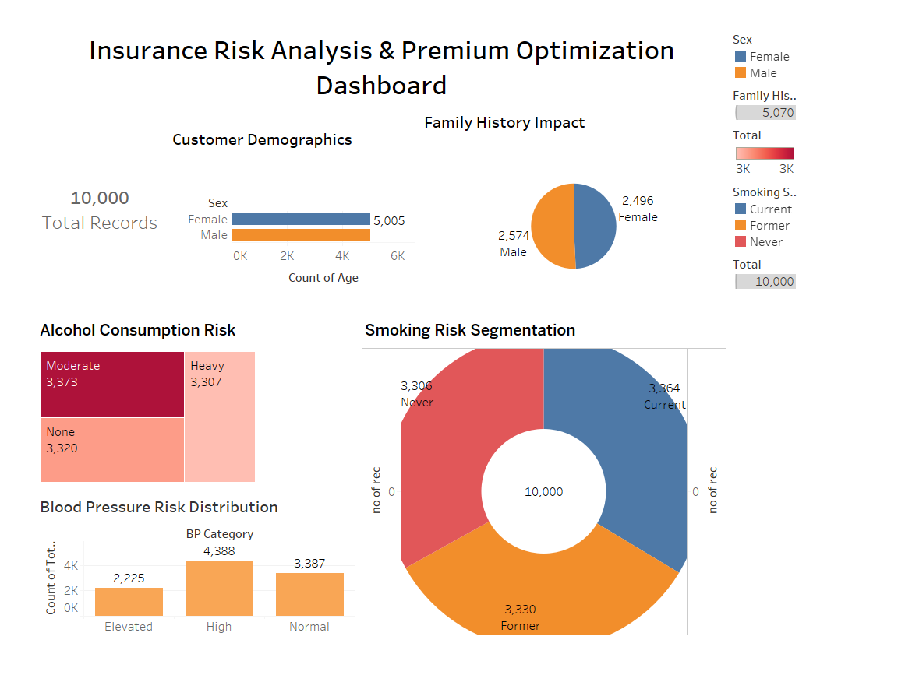
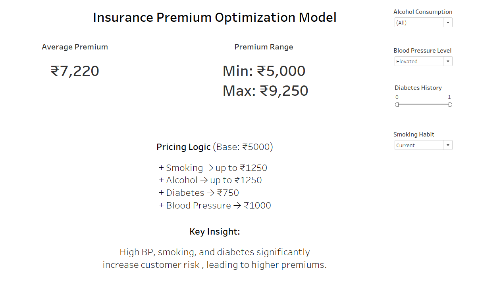

# 🏥 Insurance Premium Optimization using Risk Analysis

## 📌 Project Overview

This project analyzes a diabetes dataset to understand how health and lifestyle factors impact insurance risk, and proposes a **risk-based premium pricing model**.

The goal is to simulate how an insurance company can **adjust premiums dynamically** based on customer risk profiles.

---

## 📊 Key Features

* Interactive Tableau Dashboard
* Risk segmentation using:

  * Smoking habits
  * Alcohol consumption
  * Blood pressure levels
  * Diabetes family history
* Custom-built **premium pricing logic**

---

## 💡 Pricing Model

Base Premium: ₹5000

Additional charges:

* Smoking → up to ₹1250
* Alcohol → up to ₹1250
* Diabetes History → ₹750
* High Blood Pressure → ₹1000

---

## 📈 Key Insights

* Customers with **high BP, smoking habits, and diabetes history** show significantly higher risk.
* Lifestyle factors (smoking, alcohol) contribute heavily to premium variation.
* Premium range observed: ₹5,000 – ₹9,250

---

## 🛠 Tools Used

* Tableau (Dashboard & Visualization)
* Excel / CSV Dataset
* Basic Data Analysis Techniques

---

## 📷 Dashboard Preview

### Dashboard 1 – Risk Analysis

### Dashboard 2 – Premium Model

---

## 🚀 Future Improvements

* Add machine learning-based risk prediction
* Integrate real-world insurance datasets
* Build web app for real-time premium calculation

---

## 👤 Author

Parjanya Vasisht
www.linkedin.com/in/parjanya-vasisht-08a06b31b
